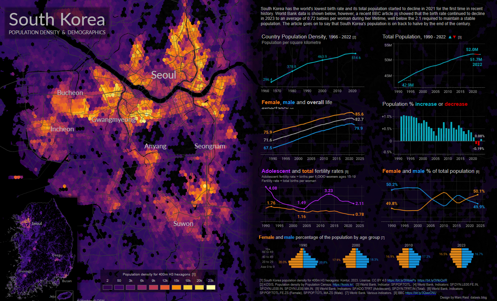

# Data Visualization

## Assignment 2: Good and Bad Data Visualization

### Requirements:

- Data visualizations are important tools for communication and convincing; we need to be able to evaluate the ways that data are presented in visual form to be critical consumers of information 
- To test your evaluation skills, locate two public data visualizations online, one good and one bad  
    - You can find data visualizations at https://public.tableau.com/app/discover or https://datavizproject.com/, or anywhere else you like! 
- For each visualization (good and bad):  
    - Explain (with reference to material covered up to date, along with readings and other scholarly sources, as needed) why you classified that visualization the way you did.
      
      **Good:**
      
      
      **Comprehensive Overview**  
       This visualization does a great job of presenting a broad range of demographic and population data in one place. It combines a population density map with key metrics like fertility rates,         life expectancy, and gender distribution, making it easy to assess trends and challenges quickly.
      
      **Clear Theme and Consistency**  
       Everything ties together under a clear theme: South Korea's population and demographics. The map and charts complement each other, creating a cohesive narrative that makes the data easy to         follow.
      
      **Visually Intuitive Design**  
       The use of colors on the density map is spot on—it immediately draws attention to densely populated areas like Seoul. The gradient is well-designed, helping users quickly identify high and        low-density regions.
      
      **Context and Explanations**  
      The text annotations throughout the visualization provide helpful context, explaining key trends like declining birth rates and population changes. This makes the visualization not just           informative but also educational.

      **Effective Use of Charts**  
       The inclusion of various chart types—line charts, bar graphs, and population pyramids—ensures a well-rounded view of the data.、

      **Bad:**
      
      

      **Overlapping Layers**  
       The overlapping areas make it difficult to differentiate between activities, especially when colors are similar or blend together. This can lead to confusion and reduce the overall                 clarity of the visualization.

      **Lack of Detailed Scale**  
       The y-axis does not provide any clear numerical value or proportion for the time spent, making it hard to interpret the actual magnitude of each activity. This leaves viewers guessing 
       about the relative importance of the activities.
  
      **Color Clarity**  
       Although the legend is provided, the use of similar shades (e.g., pink and red) makes it challenging to quickly associate activities with their categories. This can make interpreting the         graph more cumbersome.

      **Category Generalization**  
      Activities are categorized broadly, but some overlap between categories. For instance, "Cooking" could fall under enriching activities or be considered a necessity, depending on the context.This generalization might oversimplify the data.

      **Visual Crowding**  
      Displaying too many activities at once makes the visualization visually busy and harder to follow. The cluttered design can overwhelm the viewer and detract from the insights the graph aims to convey.

      

    - How could this data visualization have been improved?
      
   **Good:**
  
  **Add Interactivity**  
  Right now, the visualization is static. Adding interactive elements—like being able to hover over the map or charts to see detailed data points—would make it much more engaging. For               example, hovering over a specific city or year could show exact population or fertility rate figures.

      
  **Provide Dynamic Filtering Options**
      
  Giving users the ability to filter data by time, region, or specific metrics (like focusing on gender distribution or adolescent fertility rates) would make the visualization more                 personalized and useful for deeper analysis.

  **Bad:**

  **Add Numeric Scale**  
   Include a numerical or percentage scale on the y-axis to give viewers a clear sense of the relative time spent on each activity. This would help quantify the data and improve interpretability.

   **Improve Color Palette**  
   Use a more distinct and accessible color palette to differentiate categories more effectively. This would make the graph easier to read, especially for individuals with color blindness or visual impairments.

   **Separate Layers**  
   Add slight separation or gaps between layers to reduce overlap and improve clarity. This would make it easier to identify individual activities and their proportions.

  **Group Activities**  
   Cluster activities into broader categories (e.g., hobbies, career development, relaxation) and allow users to drill down for more detailed views. This would streamline the visualization and make it less overwhelming.

  **Highlight Key Transitions**  
   Use annotations or markers to emphasize significant life changes or activity trends. For example, highlight when an activity starts, peaks, or declines to draw attention to key insights.

  

  

  
      

- Word count should not exceed (as a maximum) 500 words for each visualization (i.e. 
300 words for your good example and 500 for your bad example)

### Why am I doing this assignment?:

- This assignment ensures active participation in the course, and assesses the learning outcomes
* Apply general design principles to create accessible and equitable data visualizations
* Use data visualization to tell a story

### Rubric:

| Component               | Scoring   | Requirement                                                 |
|-------------------------|-----------|-------------------------------------------------------------|
| Data viz classification and justification | Complete/Incomplete | - Data viz are clearly classified as good or bad - At least three reasons for each classification are provided - Reasoning is supported by course content or scholarly sources |
| Suggested improvements  | Complete/Incomplete | - At least two suggestions for improvement - Suggestions are supported by course content or scholarly sources |

## Submission Information

🚨 **Please review our [Assignment Submission Guide](https://github.com/UofT-DSI/onboarding/blob/main/onboarding_documents/submissions.md)** 🚨 for detailed instructions on how to format, branch, and submit your work. Following these guidelines is crucial for your submissions to be evaluated correctly.

### Submission Parameters:
* Submission Due Date: `HH:MM AM/PM - DD/MM/YYYY`
* The branch name for your repo should be: `assignment-2`
* What to submit for this assignment:
    * This markdown file (assignment_2.md) should be populated and should be the only change in your pull request.
* What the pull request link should look like for this assignment: `https://github.com/<your_github_username>/visualization/pull/<pr_id>`
    * Open a private window in your browser. Copy and paste the link to your pull request into the address bar. Make sure you can see your pull request properly. This helps the technical facilitator and learning support staff review your submission easily.

Checklist:
- [x] Create a branch called `assignment-2`.
- [x] Ensure that the repository is public.
- [x] Review [the PR description guidelines](https://github.com/UofT-DSI/onboarding/blob/main/onboarding_documents/submissions.md#guidelines-for-pull-request-descriptions) and adhere to them.
- [x] Verify that the link is accessible in a private browser window.

If you encounter any difficulties or have questions, please don't hesitate to reach out to our team via our Slack at `#cohort-3-help`. Our Technical Facilitators and Learning Support staff are here to help you navigate any challenges.
