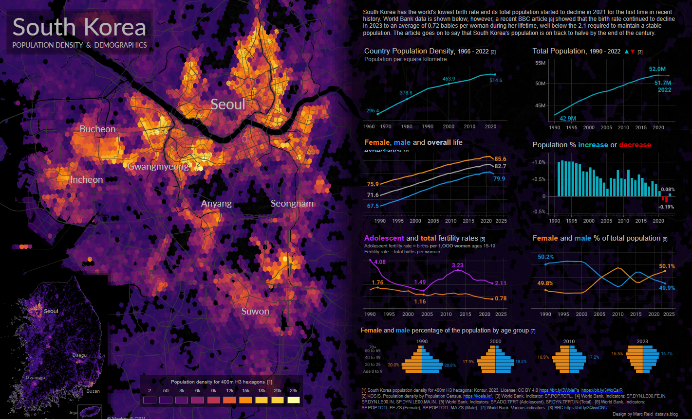
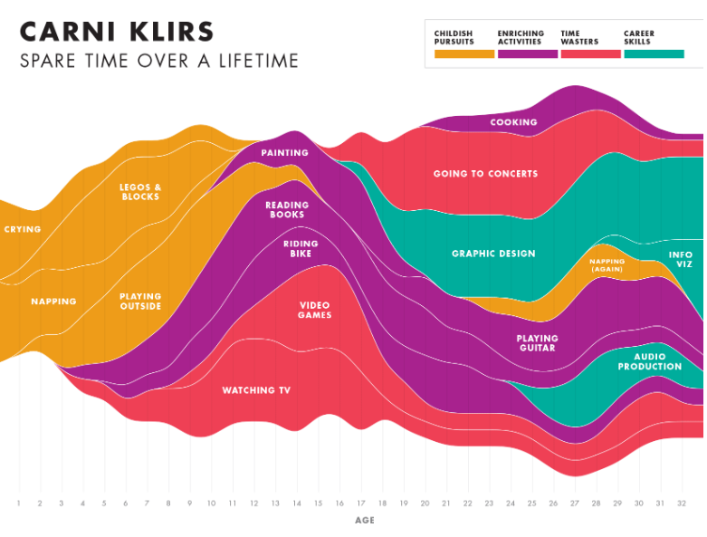

# Data Visualization

## Assignment 3: Data Visualization Ethics

### Requirements:
- Let’s return to the data visualizations we evaluated for Assignment 2.  
- For each visualization: 
    - Explain (with reference to material covered up to date, along with readings and other scholarly sources, as needed) whether or not you think this data visualization is accessible, reproducible, and equitable. 
       
## Good:

### Accessibility
The visualization is visually appealing and well-organized, making it easy to navigate. Clear color gradients and labeled sections help viewers quickly grasp population density and demographic trends. However, it heavily relies on colors that may not be suitable for colorblind users, and the small font size can make details hard to read. Interactivity is also missing, which limits its usability for users with disabilities.

### Reproducibility
The visualization cites credible data sources like the World Bank and Population Censuses, which supports its reliability. The use of standard visualization methods, such as hexagonal grids and line charts, makes it theoretically reproducible. However, it does not provide raw data, detailed processing steps, or code, which makes replication difficult for others.

### Equity
The visualization effectively highlights key demographic issues, including gender disparities and urban-rural population differences. However, it focuses heavily on urban areas like Seoul, potentially overlooking rural challenges. Socio-economic factors, which could provide a deeper understanding of inequality, are notably absent.

## Bad：

### Accessibility
- The heavy reliance on similar shades makes it hard for colorblind users to distinguish categories.
- The labels are small and often overlap, making them difficult to read in crowded sections.
- It’s a static visualization without interactivity or alternative formats for visually impaired users.

### Reproducibility
- There’s no mention of where the data came from or how activities were measured.
- It doesn’t explain how the categories were defined or how the time allocation was recorded.
- Without access to the tools or code, others can’t replicate the visualization.

### Equity
- Terms like "Time Wasters" impose value judgments that might not apply to everyone.
- It fails to account for different cultural, social, or economic backgrounds, reducing its inclusiveness.
- The focus on one narrative excludes broader patterns or diversity.

----

 - How could this data visualization have been improved (in terms of accessibility, reproducibility, equity)?
    ## Good：
    ### Accessibility
    - Use colorblind-friendly palettes and increase font size for better readability.
    - Add interactive features, such as zoom and tooltips, to make it accessible for a broader audience.

    ### Reproducibility
    - Provide raw datasets and include metadata for transparency.
    - Share detailed steps on data cleaning, aggregation, and visualization.
      
    ### Equity
    - Expand focus to include rural areas and smaller cities, ensuring more balanced geographic coverage.
    - Add socio-economic data (income levels, resource access) to deepen insights into inequalities.
    - Involve local perspectives to ensure cultural and contextual relevance.

    ### Bad：
    ### Accessibility
    - Use a colorblind-friendly palette or add patterns to differentiate categories.
    - Introduce interactive features like tooltips or zooming for easier navigation.
    
    ### Reproducibility
    - Provide the raw data and clearly explain how activities were tracked and categorized.
    - Detail the methodology and tools used to create the visualization.
      
    ### Equity
    - Replace subjective terms like "Time Wasters" with neutral labels such as "Leisure Activities."
    - Include data from multiple individuals or demographic groups to make the visualization more inclusive.
    - Add a note explaining that the visualization reflects a personal narrative rather than generalized trends.

- Word count should not exceed (as a maximum) 300 words for each visualization. 

### Why am I doing this assignment?:
- This ongoing assignment ensures active participation in the course, and assesses learning outcomes 2 and 3:  
* Apply general design principles to create accessible and equitable data visualizations
* Use data visualization to tell a story

### Rubric:
| Component               | Scoring   | Requirement                                                 |
|-------------------------|-----------|-------------------------------------------------------------|
| Data viz classification and justification | Complete/Incomplete | - Data viz are clearly classified as good or bad - At least three reasons for each classification are provided - Reasoning is supported by course content or scholarly sources |
| Suggested improvements  | Complete/Incomplete | - At least two suggestions for improvement - Suggestions are supported by course content or scholarly sources |

## Submission Information

🚨 **Please review our [Assignment Submission Guide](https://github.com/UofT-DSI/onboarding/blob/main/onboarding_documents/submissions.md)** 🚨 for detailed instructions on how to format, branch, and submit your work. Following these guidelines is crucial for your submissions to be evaluated correctly.

### Submission Parameters:
* Submission Due Date: `HH:MM AM/PM - DD/MM/YYYY`
* The branch name for your repo should be: `assignment-3`
* What to submit for this assignment:
    * This markdown file (assignment_3.md) should be populated and should be the only change in your pull request.
* What the pull request link should look like for this assignment: `https://github.com/<your_github_username>/visualization/pull/<pr_id>`
    * Open a private window in your browser. Copy and paste the link to your pull request into the address bar. Make sure you can see your pull request properly. This helps the technical facilitator and learning support staff review your submission easily.

Checklist:
- [x] Create a branch called `assignment-3`.
- [x] Ensure that the repository is public.
- [x] Review [the PR description guidelines](https://github.com/UofT-DSI/onboarding/blob/main/onboarding_documents/submissions.md#guidelines-for-pull-request-descriptions) and adhere to them.
- [x] Verify that the link is accessible in a private browser window.

If you encounter any difficulties or have questions, please don't hesitate to reach out to our team via our Slack at `#cohort-3-help`. Our Technical Facilitators and Learning Support staff are here to help you navigate any challenges.
