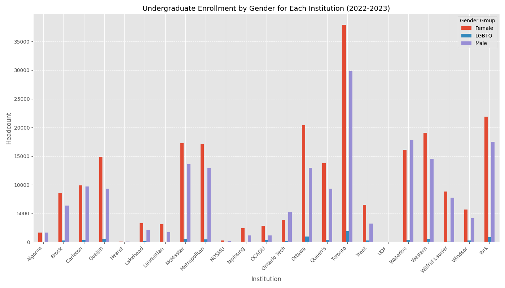
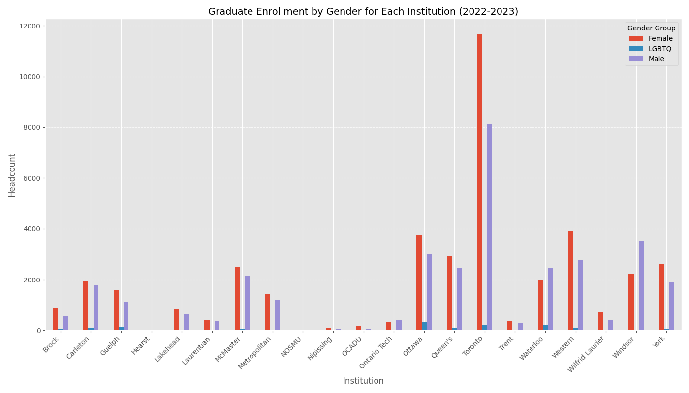
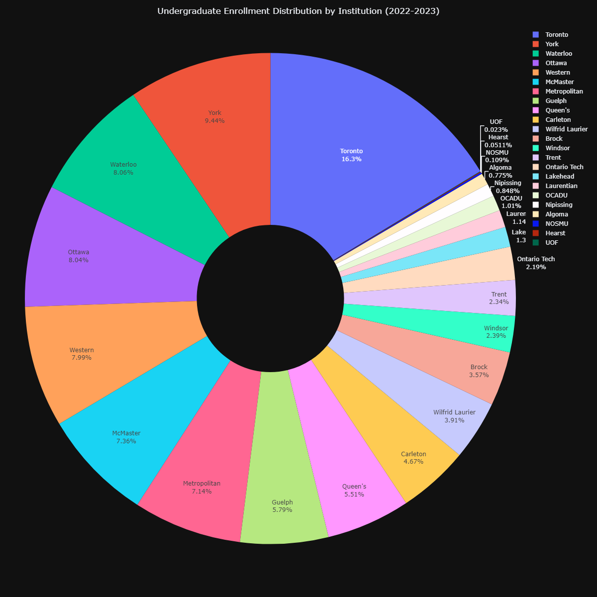
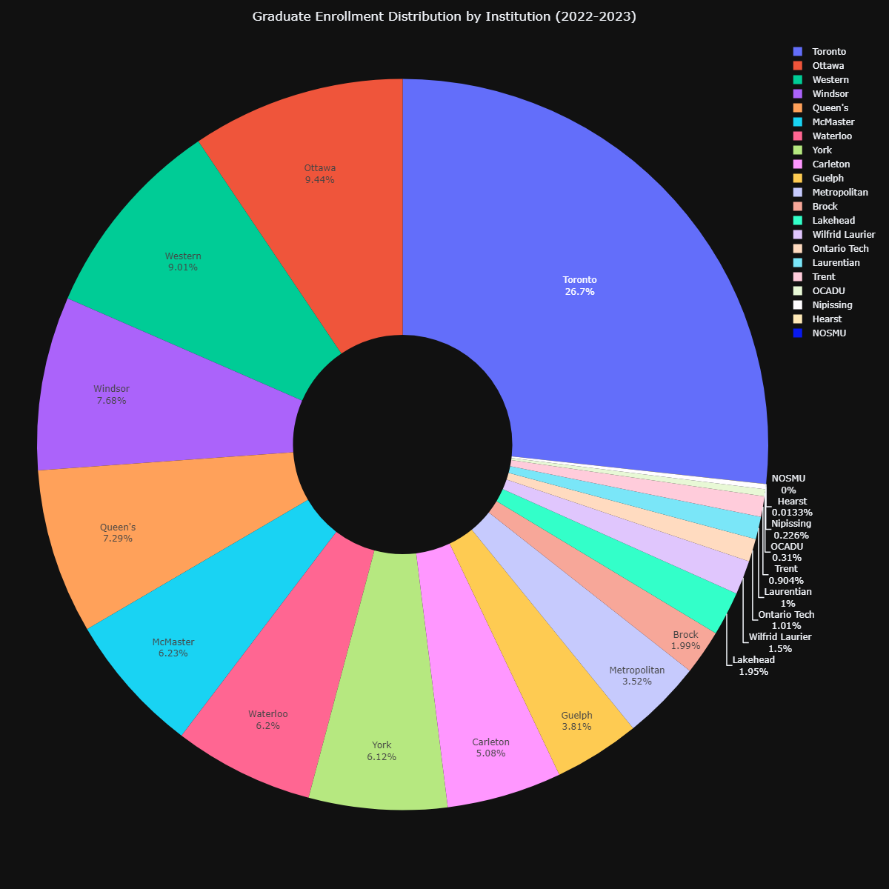
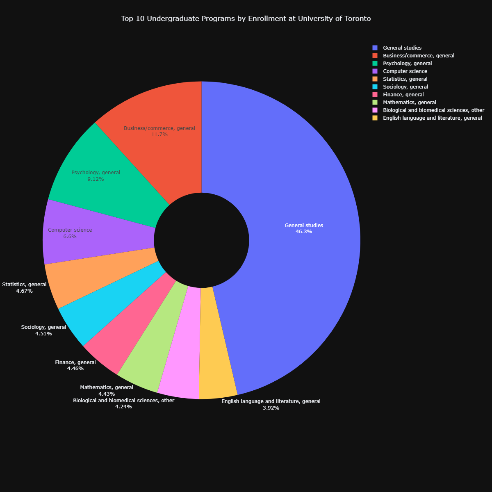
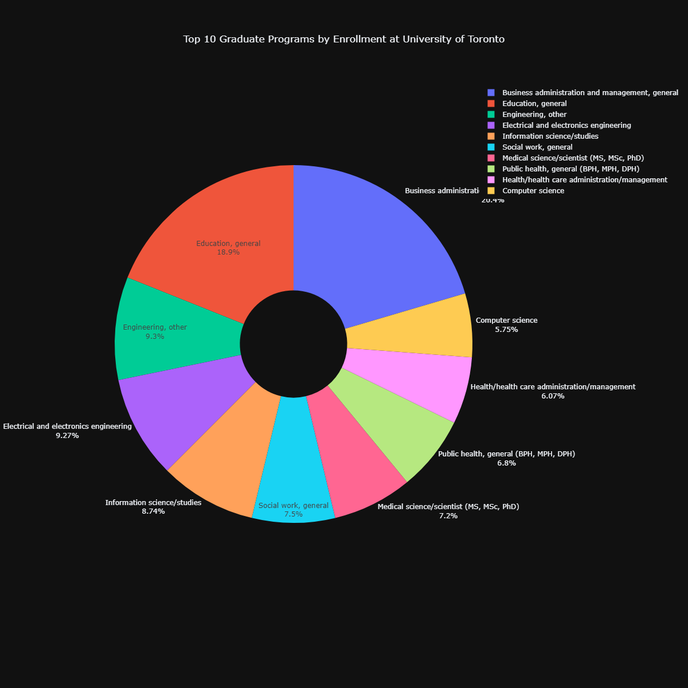
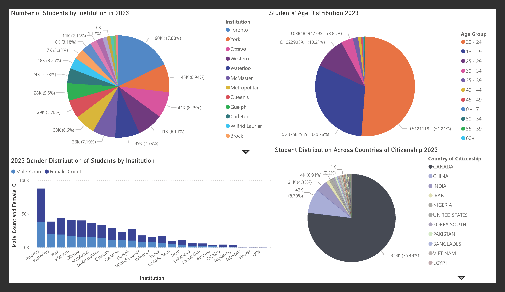

# Data Visualization

## Assignment 4: Final Project

### Requirements:
- We will finish this class by giving you the chance to use what you have learned in a practical context, by creating data visualizations from raw data. 
- Choose a dataset of interest from the [City of Toronto’s Open Data Portal](https://www.toronto.ca/city-government/data-research-maps/open-data/) or [Ontario’s Open Data Catalogue](https://data.ontario.ca/). 
- Using Python and one other data visualization software (Excel or free alternative, Tableau Public, any other tool you prefer), create two distinct visualizations from your dataset of choice.  
- For all the visualization, describe as following:
  
  **Selected dataset:
  University enrolment**
[https://data.ontario.ca/dataset/university-enrolment](https://data.ontario.ca/dataset/university-enrolment)

### Python-Generated Visualizations

#### Undergraduate Enrollment by Gender for Each Institution (2022-2023)

#### Graduate Enrollment by Gender for Each Institution (2022-2023)

#### Undergraduate Enrollment Distribution by Institution (2022-2023)

#### Graduate Enrollment Distribution by Institution (2022-2023)

#### Top 10 Undergraduate Programs at University of Toronto

#### Top 10 Graduate Programs by Enrollment at University of Toronto

---

### Power BI-Generated Visualization

#### Comprehensive Enrollment Analysis

   **What software did you use to create your data visualization?**

I used a combination of Matplotlib, Plotly, and Power BI to create the data visualizations. Matplotlib was utilized for creating detailed and highly customizable static visualizations, while Plotly provided interactivity and dynamic elements, making it easier to explore the data. Power BI was the primary tool for generating polished, professional visualizations that allowed for seamless integration of data cleaning, transformation, and reporting in one platform. 

**Who is your intended audience?**

The intended audience for these visualizations is prospective students considering enrollment in undergraduate or graduate programs at various institutions, especially the University of Toronto. These students are likely trying to understand program popularity, demographic distributions, and institutional diversity, which are all key factors when choosing where and what to study. The visualizations are designed to give them insights into these areas, helping them make more informed decisions.

**What information or message are you trying to convey with your visualization?**

The visualizations aim to provide a clear picture of how student populations are distributed across programs, institutions, and demographics. For instance, charts like "Top 10 Undergraduate Programs by Enrollment at University of Toronto" showcase the most popular fields of study, while others, such as "Graduate Enrollment Distribution by Institution (2022-2023)," highlight how students are spread across different universities. Demographic insights, like age groups and gender distribution, as well as diversity metrics, such as the countries of citizenship represented, give prospective students a well-rounded view of the academic and social landscape they might be entering.

**What design principles (substantive, perceptual, aesthetic) did you consider when making your visualization?**

In creating these visualizations, substantive principles ensured the data was directly relevant to prospective students' concerns, such as program choices, institutional diversity, and demographic breakdowns. Perceptually, the charts were designed to be clear and intuitive. For instance, pie charts were chosen for their ability to display proportional relationships, while bar charts effectively highlight comparisons, such as the gender distribution by institution. Color schemes with high contrast were used to differentiate categories and ensure readability, even for viewers with visual impairments. Aesthetically, the visuals were kept clean and professional, with modern designs like donut charts to make them visually appealing and easy to interpret.

**How did you apply these principles? With what elements of your plots?**

These principles guided every element of the visualizations. For example, in the pie charts, each category was assigned a distinct color to make differences stand out, and percentages were added directly to the chart to eliminate guesswork. In the gender distribution bar chart, consistent spacing and clear axis labels made comparisons straightforward. Legends were positioned prominently to reduce cognitive effort, and unnecessary elements were removed to keep the visuals simple and focused. The design ensured that the audience could quickly understand key insights without feeling overwhelmed by too much information.

**How did you ensure that your data visualizations are reproducible?**

To make the visualizations reproducible, I used Power BI, which allows data processing and visualization steps to be saved and reused. The datasets were cleaned systematically. Custom DAX measures, such as those calculating percentages and totals, were created to ensure consistent calculations across all charts. If another user has access to the Power BI file and the raw data, they can easily replicate the visualizations. 

**If the tool you used to make your data visualization is not reproducible, how will this impact your data visualization?**

If Power BI files or raw datasets are not shared, reproducibility could be an issue. While the logic and calculations can be replicated in tools like Excel or Python, the specific formatting and interactive features in Power BI would be harder to replicate exactly. To minimize this impact, I ensured that the cleaning and aggregation processes were well-documented.

**How did you ensure that your data visualization is accessible?**

Accessibility was a priority in the design. High-contrast colors were used to make the charts easy to read for viewers with colorblindness or low vision. Font sizes and styles were chosen for legibility across devices, and labels were added directly to the charts to display percentages and counts, reducing reliance on visual estimation. Clutter was avoided by focusing only on essential elements, ensuring the charts are approachable for audiences with varying levels of data literacy.

**Who are the individuals and communities who might be impacted by your visualization?**

The primary beneficiaries of these visualizations are prospective students, who can use the information to make better decisions about their education. Universities might also be positively impacted by the insights, as the charts can highlight their strengths, such as popular programs or diverse student populations, which can be used in marketing or recruitment. 

**How did you choose which features of your chosen dataset to include or exclude from your visualization?**

The features included in the visualizations were chosen based on their relevance to the intended audience. For example, "Country of Citizenship" and "Age Group" were included because they provide important demographic insights that prospective students often care about. The focus on the 2022-2023 academic year ensured the data was current and actionable. On the other hand, overly detailed metrics, such as enrollment numbers broken down by individual departments, were excluded to keep the visualizations clear and focused. Features that didn’t directly contribute to the message were intentionally left out to avoid overwhelming the audience.

**What ‘underwater labour’ contributed to your final data visualization product?**

A significant amount of behind-the-scenes work went into preparing these visualizations. Cleaning the data was a major task, including handling missing values, removing errors like non-numeric entries in the "HEADCOUNT" field, and aggregating data across multiple dimensions. For example, combining undergraduate and graduate enrollment numbers by institution required careful processing to avoid duplication or omissions. Creating accurate and reusable formulas in Power BI, such as those for calculating percentages, also required a deep understanding of the tool. Designing and refining the visualizations was an iterative process, involving multiple rounds of testing and feedback to ensure clarity and effectiveness. This "invisible labor" was essential to producing polished and user-friendly visualizations.

- This assignment is intentionally open-ended - you are free to create static or dynamic data visualizations, maps, or whatever form of data visualization you think best communicates your information to your audience of choice! 
- Total word count should not exceed **(as a maximum) 1000 words** 
 
### Why am I doing this assignment?:  
- This ongoing assignment ensures active participation in the course, and assesses the learning outcomes: 
* Create and customize data visualizations from start to finish in Python
* Apply general design principles to create accessible and equitable data visualizations
* Use data visualization to tell a story  
- This would be a great project to include in your GitHub Portfolio – put in the effort to make it something worthy of showing prospective employers!

### Rubric:

| Component         | Scoring  | Requirement                                                                 |
|-------------------|----------|-----------------------------------------------------------------------------|
| Data Visualizations | Complete/Incomplete | - Data visualizations are distinct from each other - Data visualizations are clearly identified - Different sources/rationales (text with two images of data, if visualizations are labeled) - High-quality visuals (high resolution and clear data) - Data visualizations follow best practices of accessibility |
| Written Explanations | Complete/Incomplete | - All questions from assignment description are answered for each visualization - Explanations are supported by course content or scholarly sources, where needed |
| Code              | Complete/Incomplete | - All code is included as an appendix with your final submissions - Code is clearly commented and reproducible |

## Submission Information

🚨 **Please review our [Assignment Submission Guide](https://github.com/UofT-DSI/onboarding/blob/main/onboarding_documents/submissions.md)** 🚨 for detailed instructions on how to format, branch, and submit your work. Following these guidelines is crucial for your submissions to be evaluated correctly.

### Submission Parameters:
* Submission Due Date: `HH:MM AM/PM - DD/MM/YYYY`
* The branch name for your repo should be: `assignment-4`
* What to submit for this assignment:
    * A folder/directory containing:
        * This file (assignment_4.md)
        * Two data visualizations 
        * Two markdown files for each both visualizations with their written descriptions.
        * Link to your dataset of choice.
        * Complete and commented code as an appendix (for your visualization made with Python, and for the other, if relevant) 
* What the pull request link should look like for this assignment: `https://github.com/<your_github_username>/visualization/pull/<pr_id>`
    * Open a private window in your browser. Copy and paste the link to your pull request into the address bar. Make sure you can see your pull request properly. This helps the technical facilitator and learning support staff review your submission easily.

Checklist:
- [x] Create a branch called `assignment-4`.
- [x] Ensure that the repository is public.
- [x] Review [the PR description guidelines](https://github.com/UofT-DSI/onboarding/blob/main/onboarding_documents/submissions.md#guidelines-for-pull-request-descriptions) and adhere to them.
- [x] Verify that the link is accessible in a private browser window.

If you encounter any difficulties or have questions, please don't hesitate to reach out to our team via our Slack at `#cohort-3-help`. Our Technical Facilitators and Learning Support staff are here to help you navigate any challenges.
